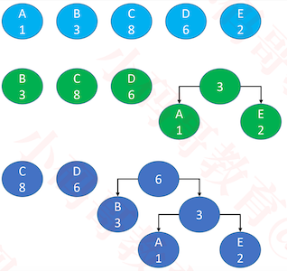
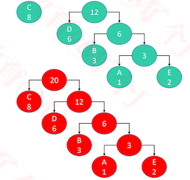

## 哈夫曼树

### 哈夫曼编码（Huffman Coding）

+ 哈夫曼编码，又称为霍夫曼编码，它是现代压缩算法的基础

+ 假设要把字符串【ABBBCCCCCCCCDDDDDDEE】转成二进制编码进行传输

  - 可以转成ASCII编码（65~69，1000001~1000101），但是有点冗长，如果希望编码更短呢？

  - 可以先约定5个字母对应的二进制

    

    - 对应的二进制编码：000001001001010010010010010010010010011011011011011011100100
    - 一共20个字母，转成了60个二进制位

  - 如果使用哈夫曼编码，可以压缩至41个二进制位，约为原来长度的68.3%

### 哈夫曼树

+ 先计算出每个字母的出现频率（权值，这里直接用出现次数），【ABBBCCCCCCCCDDDDDDEE】

  

+ 利用这些权值，构建一棵哈夫曼树（又称为霍夫曼树、最优二叉树）
+ 如何构建一棵哈夫曼树？（假设有 n 个权值）
  1. 以权值作为根节点构建 n 棵二叉树，组成森林
  2. 在森林中选出 2 个根节点最小的树合并，作为一棵新树的左右子树，且新树的根节点为其左右子树根节点之和
  3. 从森林中删除刚才选取的 2 棵树，并将新树加入森林
  4. 重复 2、3 步骤，直到森林只剩一棵树为止，该树即为哈夫曼树

+ 构建过程

  

  

### 构建哈夫曼编码

+  left为0，right为1，可以得出5个字母对应的哈夫曼编码

  

+ 【ABBBCCCCCCCCDDDDDDEE】的哈夫曼编码是
  - 1110110110110000000001010101010101111
  - **权值越大，编码越短**

+ 总结

  - n 个权值构建出来的哈夫曼树拥有 n 个叶子节点

  - 每个哈夫曼编码都不是另一个哈夫曼编码的前缀

  - 哈夫曼树是带权路径长度最短的树，权值较大的节点离根节点较近

  - 带权路径长度：树中所有的叶子节点的权值乘上其到根节点的路径

    长度。与最终的哈夫曼编码总长度成正比关系。