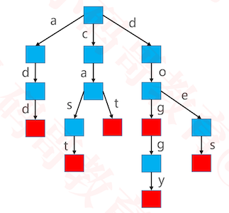

## Trie

### 需求

+ 如何判断一堆不重复的字符串是否以某个前缀开头?
  - 用Set\Map存储字符串
  - 遍历所有字符串进行判断
  - 时间复杂度为O(n)
+ 有没有更优的数据结构实现前缀搜索?
  - Trie

### 简介

+ Trie 也叫做字典树、前缀树（Prefix Tree）、单词查找树

+ Trie 搜索字符串的效率主要跟字符串的长度有关

+  假设使用 Trie 存储 cat、dog、doggy、does、cast、add 六个单词

  - 这里的红色节点，代表单词的结尾
- 根节点不包含任何字符
  
  

### 接口设计

```java
int size();
boolean isEmpty();
void clear();
boolean contains(String str);
V add(String str, V value); //同时具有存储值的功能, 可以存储值
V remove(String str);
boolean starsWith(String prefix);
```


### 基本结构

```java
public class Trie<V> {
	private int size;
	private Node<V> root;
	
	public int size() {
		return size;
	}

	public boolean isEmpty() {
		return size == 0;
	}

	public void clear() {
		size = 0;
		root = null;
	}

	public V get(String key) {
		  return null;
	}

	public boolean contains(String key) {
		return false;
	}

	public V add(String key, V value) {
		
	}

	public V remove(String key) {
		return null;
	}

	public boolean startsWith(String prefix) {
		return false;
	}
	
	private Node<V> node(String key) {		
		return null;
	}
	
	private void keyCheck(String key) {
		if (key == null || key.length() == 0) {
			throw new IllegalArgumentException("key must not be empty");
		}
	}

}

```

### Node的设计

```java
public class Trie<V> {
	private int size;
	private Node<V> root;
	
	...
  ...
  private static class Node<V> {
		Node<V> parent; //父节点
		HashMap<Character, Node<V>> children; //该结点的所有子节点
		Character character;//该结点对应的字符
		V value;
		boolean word; // 是否为单词的结尾（是否为一个完整的单词）
		public Node(Node<V> parent){
			this.parent = parent;
		}
	}
}
```

### node-获取节点

```java
//返回的node为传入的key的最后一个字符对应的节点
private Node<V> node(String key) {
		keyCheck(key);
		
		Node<V> node = root;
		int len = key.length();
		for (int i = 0; i < len; i++) {
			if (node == null || node.children == null || node.children.isEmpty()) return null;
			char c = key.charAt(i); 
      //从当前的节点的子节点中,取出字符对应的子节点
			node = node.children.get(c);
		}
		return node;
	}
	
	private void keyCheck(String key) {
		if (key == null || key.length() == 0) {
			throw new IllegalArgumentException("key must not be empty");
		}
	}
```

### clear

```
public void clear() {
		size = 0;
		root = null;
	}
```

### get

```java
public V get(String key) {
    //获取到最后一个字符对应的节点
		Node<V> node = node(key);
    //判断当前节点是否为单词结尾, 然后返回对应的值
		return node != null && node.word ? node.value : null;
}
```

### contains

```java
public boolean contains(String key) {
    //获取到最后一个字符对应的节点
		Node<V> node = node(key);
    //判断当前节点是否为单词结尾
		return node != null && node.word;
	}
```

### startWith

```java
public boolean startsWith(String prefix) {
     //只要prefix的最后一个字符对应的节点不为空，就包含
		return node(prefix) != null;
}
```

### add

```java
public V add(String key, V value) {
		keyCheck(key);
		
		//创建根节点
		if (root == null) {
			root = new Node<>(null);
		}

    Node<V> node = root;
		int len = key.length();
    //遍历key的字符
		for (int i = 0; i < len; i++) {
			char c = key.charAt(i);
			boolean emptyChildren = node.children == null;
			Node<V> childNode = emptyChildren ? null : node.children.get(c);
      //如果字符对应的节点为空,则创建节点
			if (childNode == null) {
				childNode = new Node<>(node);
				childNode.character = c; //该节点对应的字符
				node.children = emptyChildren ? new HashMap<>(): node.children;
        //并添加到父节点的children中
				node.children.put(c, childNode);
			}
			node = childNode;
		}
		//此时node为最后一个结点对应的字符
		if (node.word) { // 已经存在这个单词
			V oldValue = node.value;
			node.value = value;
			return oldValue;
		}

    // 新增一个单词
		node.word = true;
		node.value = value;
		size++;
		return null;
}
```


### remove

```java
public V remove(String key) {
		//找到最后一个节点
		Node<V> node = node(key);
		//如果不是单词的结尾，则不用处理
		if (node == null || !node.word) return null;
		size--;
		
		V oldValue = node.value;
		//如果还有子节点,把单词结尾节点变为普通节点
		if (node.children != null && !node.children.isEmpty()) {
			node.word = false;
			node.value = null;
			return oldValue;
		}
		//如果没有子节点, 则拿到父节点，从父节点的子节点中将自己删除
    //不断重复上面的过程，直到退出循环
		Node<V> parent = null;
		while ((parent = node.parent) != null) {
			parent.children.remove(node.character);
      // 父节点是单词结尾 或 已经有其他子节点时
			if (parent.word || parent.children.size() > 0) break;
			node = parent;
		}
		return oldValue;
	}

```

### 测试用例

```java
static void test1() {
		Trie<Integer> trie = new Trie<>();
		trie.add("cat", 1);
		trie.add("dog", 2);
		trie.add("catalog", 3);
		trie.add("cast", 4);
		trie.add("小码哥", 5);
		Asserts.test(trie.size() == 5);
		Asserts.test(trie.startsWith("do"));
		Asserts.test(trie.startsWith("c"));
		Asserts.test(trie.startsWith("ca"));
		Asserts.test(trie.startsWith("cat"));
		Asserts.test(trie.startsWith("cata"));
		Asserts.test(!trie.startsWith("hehe"));
		Asserts.test(trie.get("小码哥") == 5);
		Asserts.test(trie.remove("cat") == 1);
		Asserts.test(trie.remove("catalog") == 3);
		Asserts.test(trie.remove("cast") == 4);
		Asserts.test(trie.size() == 2);
		Asserts.test(trie.startsWith("do"));
		Asserts.test(!trie.startsWith("c"));
	}
```


### 总结

+ Trie 的优点：搜索前缀的效率主要跟前缀的长度有关
+ Trie 的缺点：需要耗费大量的内存，因此还有待改进
+ 更多Trie 相关的数据结构和算法
  - Double-array Trie、Suffix Tree、Patricia Tree、Crit-bit Tree、AC自动机

