## 队列

### 简介

+ 队列是一种特殊的线性表，只能在头尾两端进行操作

  - 队尾（rear）：只能从队尾添加元素，一般叫做 enQueue，入队
  - 队头（front）：只能从队头移除元素，一般叫做 deQueue，出队
  - 先进先出的原则，First In First Out，FIFO

  

### 接口设计

+ 接口
  - `int size();` //元素的数量
  - `boolean isEmpty();` //是否为空
  - `void enQueue(E element); `//入队
  - `E deQueue();` //出队
  - `E front();`//获取队列的头元素
  - `void clear();` //清空队列

+ 队列的内部实现可以直接利用以前所学的数据结构

  + 动态数组, 链表

  + 优先使用双向链表, 因为队列在头尾操作元素

    ```
    双向链表在头尾操作元素的时间复杂度都是O(1)
    
    动态数组在尾部操作元素的时间复杂度都是O(1)
    动态数组在头部操作元素的时间复杂度都是O(n)
    ```

### 实现

```java
public class Queue<E> {
  
	private List<E> list = new LinkedList<>();
	public int size() {
		return list.size();
	}
	public boolean isEmpty() {
		return list.isEmpty();
	}
	public void clear() {
		list.clear();
	}
  //入队
	public void enQueue(E element) {
		list.add(element);
	}
  //出队
	public E deQueue() {
		return list.remove(0);
	}
  //查看头元素
	public E front() {
		return list.get(0);
	}
}
```

### leetcode练习-用栈实现队列

+ https://leetcode-cn.com/problems/implement-queue-using-stacks/

  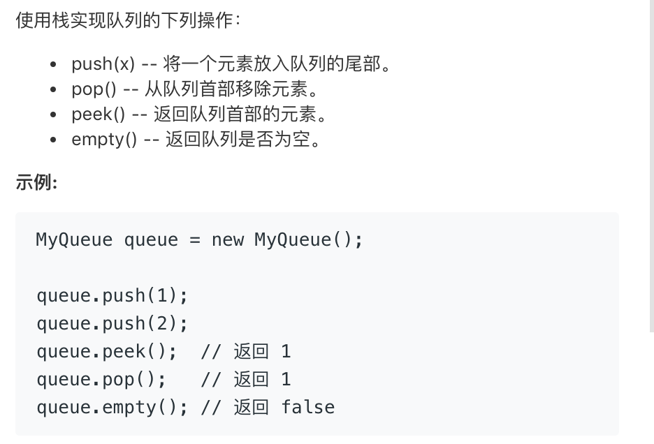

- 准备2个栈：inStack、outStack
  - 入队时，push 到 inStack 中
  - 出队时
    - 如果 outStack 为空，将 inStack 所有元素逐一弹出，push 到 outStack，outStack 弹出栈顶元素
    - 如果 outStack 不为空， outStack 弹出栈顶元素

+ 假设如下操作: 11入队， 22入队，出队， 33入队， 出队

  + 11入队， 22入队

    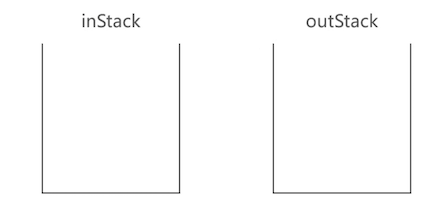

    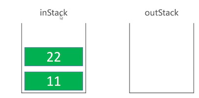

    

    

  + 出队

    - 将inStack中的元素全部出栈，并入栈到outStack中
    - 井outStack的栈顶元素出栈

    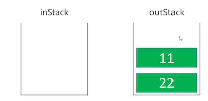

    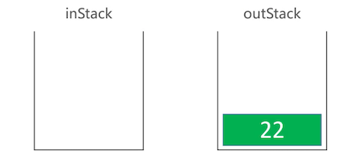

  + 33入队

    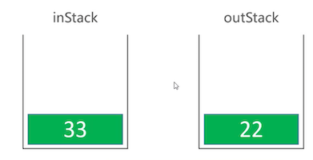

  + 出队

    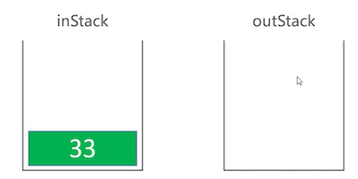

+ 代码如下

  ```java
  public class _232_用栈实现队列 {
  	private Stack<Integer> inStack;
  	private Stack<Integer> outStack;
  
      /** Initialize your data structure here. */
      public _232_用栈实现队列() {
      	inStack = new Stack<>();
      	outStack = new Stack<>();
      }
      
      /** 入队 */
      public void push(int x) {
          inStack.push(x);
      }
      
      /** 出队 */
      public int pop() {
      	checkOutStack();
      	return outStack.pop();
      }
      
      /** 获取队头元素 */
      public int peek() {
      	checkOutStack();
      	return outStack.peek();
      }
      
      /** 是否为空 */
      public boolean empty() {
      	return inStack.isEmpty() && outStack.isEmpty();
      }
      
      private void checkOutStack() {
        //出队时，若outStack不为空，则将inStack出栈，并入栈到outStack中
      	if (outStack.isEmpty()) {
          	while (!inStack.isEmpty()) {
          		outStack.push(inStack.pop());
          	}
          }
      }
  }
  
  ```

### queue源码分析

+ 在java.util.Queue中查看, Queue被定义为interface

  ```java
  public interface Queue<E> extends Collection<E> {
      boolean add(E e); 
      boolean offer(E e);
      E remove();
      E poll();
      E element();  
      E peek();
  }
  ```
  
+ 在java中LinkedList实现了队列的功能

  ```java
  public class LinkedList<E>
      extends AbstractSequentialList<E>
      implements List<E>, Deque<E>, Cloneable, java.io.Serializable {
      ....
      ....
  }
  
  //Deque双端队列接口
  public interface Deque<E> extends Queue<E> {
     ....
     ....
     ....
  }
  ```

### 双端队列

+ **双端队列**是能在头尾两端添加、删除的队列
  
  - 英文 deque 是 double ended queue 的简称
+ 接口设计
  - `int size(); `// 元素的数量
  - `boolean isEmpty();` // 是否为空
  - `void clear();` // 清空
  - `void enQueueRear(E element);` // 从队尾入队
  - `E deQueueFront(); `// 从队头出队
  - `void enQueueFront(E element);` // 从队头入队
  - `E deQueueRear();` // 从队尾出队
  - `E front(); `// 获取队列的头元素
  - `E rear(); `// 获取队列的尾元素

+ 代码实现

  ```java
  public class Deque<E> {
  	private List<E> list = new LinkedList<>();
  	
  	public int size() {
  		return list.size();
  	}
  
  	public boolean isEmpty() {
  		return list.isEmpty();
  	}
  	
  	public void clear() {
  		list.clear();
  	}
  
  	public void enQueueRear(E element) {
  		list.add(element);
  	}
    
    public E deQueueRear() {
  		return list.remove(list.size() - 1);
  	}
    
    public void enQueueFront(E element) {
  		list.add(0, element);
  	}
  
  	public E deQueueFront() {
  		return list.remove(0);
  	}
  
  	public E front() {
  		return list.get(0);
  	}
  
  	public E rear() {
  		return list.get(list.size() - 1);
  	}
  }
  ```
  
+ java官方的LinkedList已经实现了Deque接口

### %运算符优化

+ 尽量避免使用乘*、除/、模%、浮点数运算，效率低下
+ 已知n>=0，m>0
  - n%m 等价于 n – (m > n ? 0 : m) 的前提条件：n < 2m

### 循环队列-简介

+ 循环队列底层用**数组**实现

  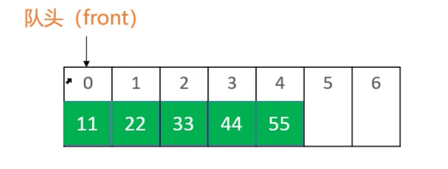

  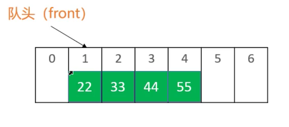

  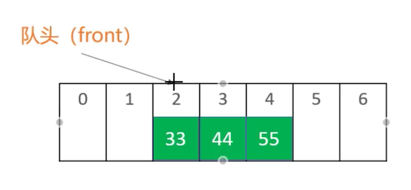

  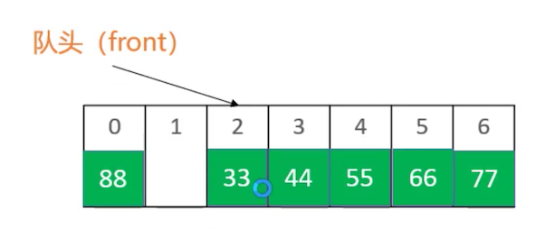

+ 其实队列的底层也可以使用动态数组实现，并且各项接口也可以优化到O(1)的时间复杂度, 这个用数组

  实现并且和优化之后的队列也叫做: **循环队列**

### 循环队列-实现

```java
package com.mj.circle;

@SuppressWarnings("unchecked")
public class CircleQueue<E> {
	private int front; //首元素的索引
	private int size;
	private E[] elements;
	private static final int DEFAULT_CAPACITY = 10;
	
	public CircleQueue() {
		elements = (E[]) new Object[DEFAULT_CAPACITY];
	}
	
	public int size() {
		return size;
	}

	public boolean isEmpty() {
		return size == 0;
	}
	
	public void clear() {
		for (int i = 0; i < size; i++) {
			elements[index(i)] = null;
		}
		front = 0;
		size = 0;
	}

	public void enQueue(E element) {
    //进行扩容
		ensureCapacity(size + 1);
		//入队，发element赋值给队列的第size个元素
		elements[index(size)] = element;
		size++;
	}

	public E deQueue() {
		E frontElement = elements[front];
    //将原来的front置为空
		elements[front] = null;
    //按逻辑index来理解的话，font始终指向0，从front出队后，逻辑font=1
		front = index(1);
		size--;
		return frontElement;
	}

	public E front() {
		return elements[front];
	}
	
	@Override
	public String toString() {
		StringBuilder string = new StringBuilder();
		string.append("capcacity=").append(elements.length)
		.append(" size=").append(size)
		.append(" front=").append(front) //打印出front，便于定位
		.append(", [");
		for (int i = 0; i < elements.length; i++) {
			if (i != 0) {
				string.append(", ");
			}
			
			string.append(elements[i]);
		}
		string.append("]");
		return string.toString();
	}
	
  
 
  //将队列逻辑上的index映射为内部数组真实的index
	private int index(int index) {
    //%优化
		index += front;
		return index - (index >= elements.length ? elements.length : 0);
    //return (index + front)% elements.length;
    
	}
	
	/**
	 * 保证要有capacity的容量
	 * @param capacity
	 */
	private void ensureCapacity(int capacity) {
		int oldCapacity = elements.length;
		if (oldCapacity >= capacity) return;
		
		// 新容量为旧容量的1.5倍
		int newCapacity = oldCapacity + (oldCapacity >> 1);
		E[] newElements = (E[]) new Object[newCapacity];
		for (int i = 0; i < size; i++) {
      //将队列逻辑上的index映射为内部数组真实的index，然后取出对应的值
			newElements[i] = elements[index(i)];
		}
		elements = newElements;
		// 重置front
		front = 0;
	}
}

```

+ 测试代码

  ```java
  static void test2() {
  		CircleQueue<Integer> queue = new CircleQueue<Integer>();
  
      //[0, 1, 2, 3, 4, 5, 6, 7, 8, 9]
      for (int i = 0; i < 10; i++) {
  			queue.enQueue(i);
  		}
  		System.out.println(queue);
  		//[null, null, null, null, null, 5, 6, 7, 8, 9]
  		for (int i = 0; i < 5; i++) {
  			queue.deQueue();
  		}
  		System.out.println(queue);
  		
  		// [15, 16, 17, 18, 19, 5, 6, 7, 8, 9]
  		for (int i = 15; i < 20; i++) {
  			queue.enQueue(i);
  		}
  		System.out.println(queue);
    
  		//[5, 6, 7, 8, 9, 15, 16, 17, 18, 19, 20, 21, 22, null, null]
  		for (int i = 20; i < 23; i++) {
  			queue.enQueue(i);
  		}
  		System.out.println(queue);
  	}
  	
  //打印结果为
  capcacity=10 size=10 front=0, [0, 1, 2, 3, 4, 5, 6, 7, 8, 9]
  capcacity=10 size=5 front=5, [null, null, null, null, null, 5, 6, 7, 8, 9]
  capcacity=10 size=10 front=5, [15, 16, 17, 18, 19, 5, 6, 7, 8, 9]
  capcacity=15 size=13 front=0, [5, 6, 7, 8, 9, 15, 16, 17, 18, 19, 20, 21, 22, null, null]
  
  ```


### 循环双端队列

+ 可以进行两端添加, 删除的循环队列

+ 代码实现如下

  ```java
  @SuppressWarnings("unchecked")
  public class CircleDeque<E> {
    //不需要一个变量保存尾部的index，因为尾部的index = (front + size)% elements.length
  	private int front;
  	private int size;
  	private E[] elements;
  	private static final int DEFAULT_CAPACITY = 10;
  	
  	public CircleDeque() {
  		elements = (E[]) new Object[DEFAULT_CAPACITY];
  	}
  	
  	public int size() {
  		return size;
  	}
  
  	public boolean isEmpty() {
  		return size == 0;
  	}
  
  	public void clear() {
  		for (int i = 0; i < size; i++) {
  			elements[index(i)] = null;
  		}
  		front = 0;
  		size = 0;
  	}
  
  	/**
  	 * 从尾部入队
  	 * @param element
  	 */
  	public void enQueueRear(E element) {
  		ensureCapacity(size + 1);
  		
  		elements[index(size)] = element;
  		size++;
  	}
    
    /**
  	 * 从尾部出队
  	 * @param element
  	 */
  	public E deQueueRear() {
  		int rearIndex = index(size - 1);
  		E rear = elements[rearIndex];
  		elements[rearIndex] = null;
  		size--;
  		return rear;
  	}
  
  	/**
  	 * 从头部出队
  	 * @param element
  	 */
  	public E deQueueFront() {
  		E frontElement = elements[front];
  		elements[front] = null;
      //逻辑上front=0，所以从头部出队后，相当于逻辑上font指向1
  		front = index(1);
  		size--;
  		return frontElement;
  	}
  
  	/**
  	 * 从头部入队
  	 * @param element
  	 */
  	public void enQueueFront(E element) {
  		ensureCapacity(size + 1);
  		//逻辑上front=0，所以往头部插入，相当于逻辑上向-1位置插入
  		front = index(-1);
  		elements[front] = element;
  		size++;
  	}
  
  	
  
  	public E front() {
  		return elements[front];
  	}
  
  	public E rear() {
  		return elements[index(size - 1)];
  	}
  
  	@Override
  	public String toString() {
  		StringBuilder string = new StringBuilder();
  		string.append("capcacity=").append(elements.length)
  		.append(" size=").append(size)
  		.append(" front=").append(front)
  		.append(", [");
  		for (int i = 0; i < elements.length; i++) {
  			if (i != 0) {
  				string.append(", ");
  			}
  			
  			string.append(elements[i]);
  		}
  		string.append("]");
  		return string.toString();
  	}
  	
  	private int index(int index) {
  		index += front;
  		if (index < 0) { //当front=0时，往头部添加元素
  			return index + elements.length;
  		}
      //%优化
  		return index - (index >= elements.length ? elements.length : 0);
      //return (index + front)% elements.length;
  	}
  	
  	/**
  	 * 保证要有capacity的容量
  	 * @param capacity
  	 */
  	private void ensureCapacity(int capacity) {
  		int oldCapacity = elements.length;
  		if (oldCapacity >= capacity) return;
  		
  		// 新容量为旧容量的1.5倍
  		int newCapacity = oldCapacity + (oldCapacity >> 1);
  		E[] newElements = (E[]) new Object[newCapacity];
  		for (int i = 0; i < size; i++) {
  			newElements[i] = elements[index(i)];
  		}
  		elements = newElements;
  		
  		// 重置front
  		front = 0;
  	}
  }
  
  ```

  

### clear

```java
public void clear() {
		for (int i = 0; i < size; i++) {
		  //找到真实的位置
			elements[index(i)] = null;
		}
		front = 0;
		size = 0;
	}
```


### 作业 – 用队列实现栈

+ https://leetcode-cn.com/problems/implement-stack-using-queues/